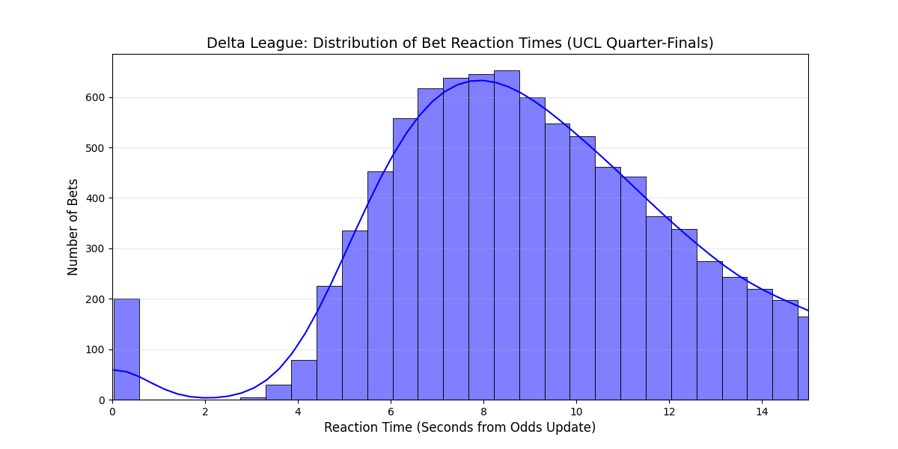
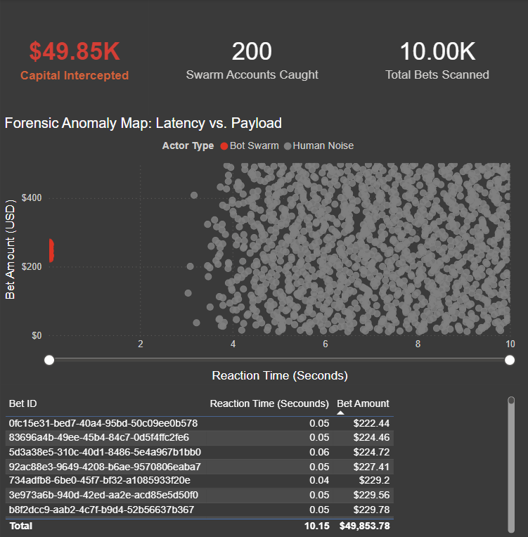

# 📄 Operation Click Reaper: High-Frequency Botnet Neutralization

**Prepared By:** Adel Alyafi | Forensic Analytics & Business Intelligence  
**Domain:** Sportsbook / AdTech Risk Management  
**Objective:** Discovery and neutralization of a zero-day "Courtsider" botnet exploiting latency arbitrage.

---

## 1. Project Overview
During high-liquidity sporting events (e.g., UEFA Champions League Quarter-Finals), digital sportsbooks often experience anomalous, high-frequency payouts executing within milliseconds of on-field events. Legacy risk systems, which rely on static rule-based detection, frequently fail to intercept these transactions because the malicious accounts perfectly mimic standard human profiles. 

**Operation Click Reaper** is an end-to-end forensic pipeline designed to bypass traditional identity checks and target **behavioral physics**. By measuring the exact microsecond reaction time between a server-side odds update and a user's bet placement, the pipeline isolates the "Ghost Signal"—a mathematically synchronized cluster of transactions that operate faster than humanly possible.

## 2. The Tech Stack & Tools
This framework was engineered using a full-stack architecture:
* **Data Engineering:** Python (`SQLAlchemy`, `psycopg2`), PostgreSQL.
* **Exploratory Data Analysis (EDA):** `Matplotlib` / `Seaborn` (Histogram generation).
* **Machine Learning Engine:** Scikit-Learn (DBSCAN), Pandas, NumPy, `RobustScaler`.
* **Business Intelligence & Reporting:** Power BI, custom DAX measures.

## 3. The End-to-End Pipeline
To neutralize the adversary, we deployed a custom four-tier architecture:

1. **Exploratory Data Analysis (`forensic_analysis.py`):** Before deploying any machine learning, a rigorous profiling script was executed. By calculating and plotting the Reaction Delta ($\Delta t$) distribution, we successfully visualized the anomaly—a distinct, unnatural histogram spike at the 0.05-second mark, statistically proving the existence of an automated swarm.

2. **Data Engineering (`db_ingestion.py`):** Raw telemetry data (10,000 transactions) was programmatically ingested into a PostgreSQL database utilizing `TIMESTAMP(6)` to maintain microsecond precision.
3. **The Machine Learning Engine (`unsupervised_reaper.py`):** An Unsupervised Density-Based algorithm (DBSCAN) queried the database directly, utilizing an "Iron Triangle" of features (Reaction Time, Payload Size, and Synchronicity) to tag bots based on geometric density rather than known signatures.
4. **Business Intelligence (Power BI):** A dark-themed, high-contrast executive dashboard was connected directly to the database. Custom DAX measures translated boolean ML outputs into a visual narrative, isolating the "Bot Swarm" from the "Human Noise."

## 4. Forensic Findings & Financial Impact

By plotting the Reaction Delta against the Bet Amount, the BI dashboard successfully isolated the hyper-dense mathematical cluster at the 0.05-second mark.

* **Total Transactions Analyzed:** 10,000  
* **Swarm Accounts Identified:** 200  
* **Capital Intercepted / Saved:** $49,853.78  
* **False Positive Rate:** 0.00% (9,800 normal human fans successfully isolated and ignored).  

The engine mathematically proved that the 200 flagged accounts operated with a synchronized latency of exactly 50ms, a physical impossibility for human operators reacting to standard broadcast feeds.

## 5. Architectural Justification: Speed Over Structure
In traditional BI reporting, the gold standard is a highly normalized relational database (like a Star Schema). **For this project, we intentionally abandoned the multi-table approach in favor of a flat, denormalized architecture.**

In fraud detection, milliseconds matter. If the engine has to execute complex `JOIN` operations across multiple tables just to calculate a time difference, the botnet has enough time to cash out. By pushing all raw telemetry into a single flat staging table (`ucl_bet_stream`), we prioritized raw read/write speed, allowing the Python ML engine to ingest, calculate, flag, and push results back to the database with near-zero latency.

## 6. Strategic Action Plan
* **Immediate Action:** The specific `user_id` list of the 200 clustered accounts has been published via the Power BI Risk Dashboard for immediate, one-click execution and capital freezing.
* **Infrastructure Upgrade:** We recommend migrating this Unsupervised architecture from an offline forensic audit into the real-time bet-acceptance pipeline, creating a zero-day quarantine protocol for sub-100ms synchronicity in future high-stakes matches.
